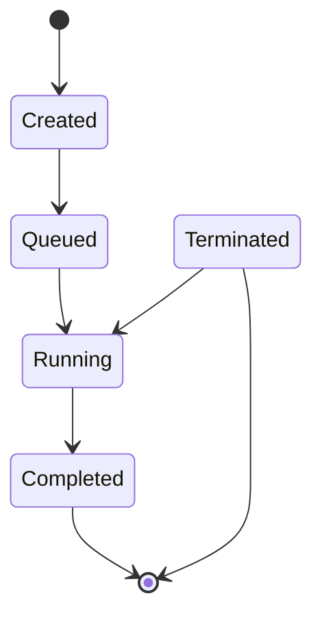

# Eventflow
Personal project to build a production-grade async job processing platform with retries, idempotency

## Functional Requirements
- User can create jobs to be process immediately
- User can create jobs to be executed at a later time
- User can see the job's status by unique identifier
- Jobs should be executed exactly once

## Non-functional Requirements
- Job execution should be idempotent 
- Job should be retried if failed
- System should be able to handle on-the-clock spikes
- For fetching job status, we should prioritize availability. Eventual consistency is acceptable

## Job's Lifecycle
